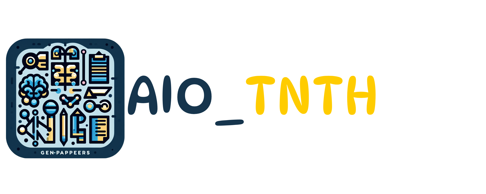

 

## AIO_TNTH

This product supports check beer Heneiken.

<p align="middle">
  
### Contributors

| Avatar | Name               | 
| ------ | ------------------ |
|        | Nguyen Nhat Thuong | 
|       | Nguyen Thi Nam Phuong | 
|       | Tran Van Thien | 
|       | Mai Duc Minh Huy | 

### Programming Languages 


### Frameworks and Libraries 


### Technique and Tools 

- Python notebook
- Visual studio code
- Google Colab

### Structure of Repositories 
```
AIO_TNTH/
│
├── client/   
│   │
│   ├── Coming soon             
│   │ 
│   └── Coming soon 
│
├── server/   
│   │
│   ├── ocr/              
│   │ 
│   ├── yolo/ 
│   │ 
│   ├── ocr_llms/              
│   │ 
│   └── api/     
│    
└── readme.md             
```

You can also follow my GitHub Profile to stay updated about my latest projects: [](https://github.com/ngnhthuong)

If you liked the repo then please support it by giving it a star ⭐!
